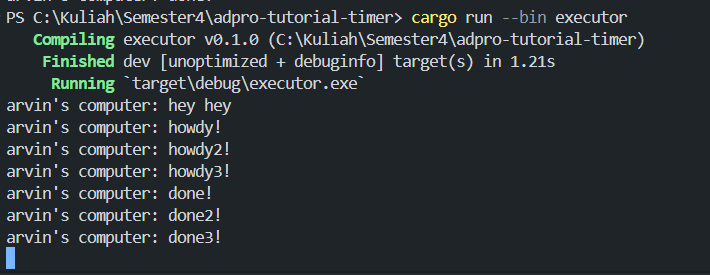
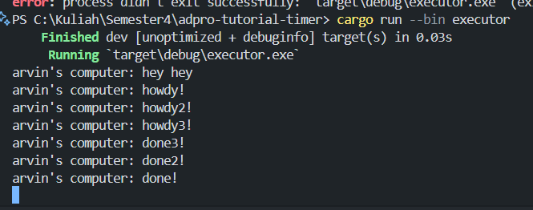

### Result

Hal itu dikarenakan fungsi spawner bersifat asynchronous (async). Sehingga, program tidak akan menunggu async tersebut dan melanjutkan print `hey hey` terlebih dahulu.

Program tidak akan berhenti karena dianggap masih menunggu pengiriman data dari spawner. Kemudian, dijalankan beberapa spawner secara asinkronus. Sehingga, beberapa spawner mengeluarkan print secara bersamaan.